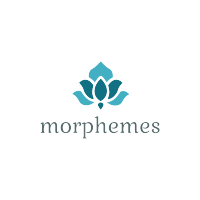

<div id="top"></div>
<!--
*** Thanks for checking out the Best-README-Template. If you have a suggestion
*** that would make this better, please fork the repo and create a pull request
*** or simply open an issue with the tag "enhancement".
*** Don't forget to give the project a star!
*** Thanks again! Now go create something AMAZING! :D
-->


<!-- PROJECT SHIELDS -->
<!--
*** I'm using markdown "reference style" links for readability.
*** Reference links are enclosed in brackets [ ] instead of parentheses ( ).
*** See the bottom of this document for the declaration of the reference variables
*** for contributors-url, forks-url, etc. This is an optional, concise syntax you may use.
*** https://www.markdownguide.org/basic-syntax/#reference-style-links
-->
[![Contributors][contributors-shield]][contributors-url]
[![Forks][forks-shield]][forks-url]
[![Stargazers][stars-shield]][stars-url]
[![Issues][issues-shield]][issues-url]
[![MIT License][license-shield]][license-url]

[//]: # ([![LinkedIn][linkedin-shield]][linkedin-url])


<!-- PROJECT LOGO -->
<br />
<div align="center">
  <a href="https://github.com/github_username/repo_name">
    
  </a>

<h3 align="center">morphemes</h3>

  <p align="center">
    A practical Python Library for identifying morphemes in the english language.
    <br />

[//]: # (    <a href="https://github.com/ecscstatsconsulting/morphemes"><strong>Explore the docs »</strong></a>)

[//]: # (    <br />)
    <br />

[//]: # (    <a href="https://github.com/github_username/repo_name">View Demo</a>)

[//]: # (    ·)
    <a href="https://github.com/ecscstatsconsulting/morphemes/issues">Report Bug</a>
    ·
    <a href="https://github.com/ecscstatsconsulting/morphemes/issues">Request Feature</a>
  </p>
</div>


<!-- TABLE OF CONTENTS -->
<details>
  <summary>Table of Contents</summary>
  <ol>
    <li>
      <a href="#about-the-project">About The Project</a>
      <ul>
        <li><a href="#built-with">Built With</a></li>
      </ul>
    </li>
    <li>
      <a href="#getting-started">Getting Started</a>
      <ul>
        <li><a href="#prerequisites">Prerequisites</a></li>
        <li><a href="#installation">Installation</a></li>
      </ul>
    </li>
    <li><a href="#usage">Usage</a></li>
    <li><a href="#roadmap">Roadmap</a></li>
    <li><a href="#contributing">Contributing</a></li>
    <li><a href="#license">License</a></li>
    <li><a href="#contact">Contact</a></li>
    <li><a href="#acknowledgments">Acknowledgments</a></li>
  </ol>
</details>


<!-- ABOUT THE PROJECT -->
## About The Project

A simple and practical solution for obtaining morpheme information
for a word.  The majority of the logic uses a simple lookup strategy
based off of the [MorphoLex-en](https://github.com/hugomailhot/MorphoLex-en)
project.  Additional logic will be added to handle unknown's, names,
locations and other edge cases.  This is a non-contextual solution intended
to feed more complex logic for NLP.

<p align="right">(<a href="#top">back to top</a>)</p>


### Built With

* [MorphoLex-en](https://github.com/hugomailhot/MorphoLex-en)
* [tinydb](https://tinydb.readthedocs.io/en/latest/)
* [pandas](https://pandas.pydata.org/)

<p align="right">(<a href="#top">back to top</a>)</p>


<!-- GETTING STARTED -->
## Getting Started

Using this library is fairly routine and easy.  More detail will be added
to this section as we get closer to the first release.

### Prerequisites

This project was developed with Python 3.9 other versions of Python 3 
*should* work.

### Installation

  ```sh
  pip install git+https://github.com/ecscstatsconsulting/morphemes.git
  ```

<p align="right">(<a href="#top">back to top</a>)</p>


<!-- USAGE EXAMPLES -->
## Usage

```python
from morphemes import Morphemes

path = "./data"

m = Morphemes(path)
print(m.parse("organizationally"))
```
Output:
```json
{
  "word": "organizationally",
  "morpheme_count": 5,
  "tree": [
    {
      "children": [
        {
          "text": "organ",
          "type": "root"
        },
        {
          "text": "ize",
          "type": "bound"
        }
      ],
      "type": "free"
    },
    {
      "text": "ion",
      "type": "bound"
    },
    {
      "text": "al",
      "type": "bound"
    },
    {
      "text": "ly",
      "type": "bound"
    }
  ]
}
```

NOTE: the `data` path specified is where the morphemes library will
store a database containing morphemes from [MorphoLex-en](https://github.com/hugomailhot/MorphoLex-en)
along with other lookups to help properly detect morphemes.

<p align="right">(<a href="#top">back to top</a>)</p>


<!-- ROADMAP -->
## Roadmap

- [X] Morpheme detection of known words
- [ ] Handling of common names and places
- [ ] Handling of unknown words


See the [open issues](https://github.com/ecscstatsconsulting/morphemes/issues) for a full list of 
proposed features (and known issues).

<p align="right">(<a href="#top">back to top</a>)</p>


<!-- CONTRIBUTING -->
## Contributing

Contributions are what make the open source community such an amazing 
place to learn, inspire, and create. Any contributions you make are 
**greatly appreciated**.

Do you want other languages supported?  Are you an fluent speaker of the
language you want?  Help contribute and grow this project in to a more
universal morpheme solution!

If you have a suggestion that would make this better, please fork the repo 
and create a pull request. You can also simply open an issue with the tag 
"enhancement".  Don't forget to give the project a star! Thanks again!

1. Fork the Project
2. Create your Feature Branch (`git checkout -b feature/AmazingFeature`)
3. Commit your Changes (`git commit -m 'Add some AmazingFeature'`)
4. Push to the Branch (`git push origin feature/AmazingFeature`)
5. Open a Pull Request

<p align="right">(<a href="#top">back to top</a>)</p>


<!-- LICENSE -->
## License

Distributed under the MIT License. See `LICENSE.txt` for more information.

<p align="right">(<a href="#top">back to top</a>)</p>


<!-- CONTACT -->
## Contact

ECSC, ltd - ecsctechdepartment@gmail.com

Project Link: [https://github.com/ecscstatsconsulting/morphemes](https://github.com/ecscstatsconsulting/morphemes)

<p align="right">(<a href="#top">back to top</a>)</p>


<!-- ACKNOWLEDGMENTS -->
## Acknowledgments

* [Enkeleda Cuko]()
* [Paul Warren](https://github.com/paul0warren)

<p align="right">(<a href="#top">back to top</a>)</p>


<!-- MARKDOWN LINKS & IMAGES -->
<!-- https://www.markdownguide.org/basic-syntax/#reference-style-links -->
[contributors-shield]: https://img.shields.io/github/contributors/ecscstatsconsulting/morphemes.svg?style=for-the-badge
[contributors-url]: https://github.com/ecscstatsconsulting/morphemes/graphs/contributors
[forks-shield]: https://img.shields.io/github/forks/ecscstatsconsulting/morphemes.svg?style=for-the-badge
[forks-url]: https://github.com/ecscstatsconsulting/morphemes/network/members
[stars-shield]: https://img.shields.io/github/stars/ecscstatsconsulting/morphemes.svg?style=for-the-badge
[stars-url]: https://github.com/ecscstatsconsulting/morphemes/stargazers
[issues-shield]: https://img.shields.io/github/issues/ecscstatsconsulting/morphemes.svg?style=for-the-badge
[issues-url]: https://github.com/ecscstatsconsulting/morphemes/issues
[license-shield]: https://img.shields.io/github/license/ecscstatsconsulting/morphemes.svg?style=for-the-badge
[license-url]: https://github.com/ecscstatsconsulting/morphemes/blob/master/LICENSE.txt
[linkedin-shield]: https://img.shields.io/badge/-LinkedIn-black.svg?style=for-the-badge&logo=linkedin&colorB=555

[//]: # ([linkedin-url]: https://linkedin.com/in/linkedin_username)
[//]: # ([product-screenshot]: images/screenshot.png)